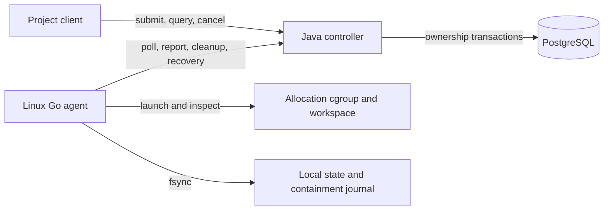

# System architecture

Clearance separates durable ownership in PostgreSQL from physical execution on a
trusted Linux runner. A finished command is not evidence that a runner is reusable:
the controller retains ownership until the current agent proves cleanup.

## Components and data flow

| Boundary | Implemented responsibility and entry points |
| --- | --- |
| Controller | [JobService](../../controller/src/main/java/com/clearance/controller/jobs/JobService.java) accepts project-scoped idempotent jobs; [SchedulerService](../../controller/src/main/java/com/clearance/controller/scheduling/SchedulerService.java) claims a compatible runner; [AgentService](../../controller/src/main/java/com/clearance/controller/agent/AgentService.java) fences reports, releases cleaned ownership, and creates recovery retries. |
| Agent | [Daemon](../../agent/daemon.go) coordinates polling, serial reports, and allocation execution; [containment](../../agent/containment_linux.go) launches into cgroup v2 and scrubs workspaces; [recovery](../../agent/containment_recovery_linux.go) discovers surviving execution after restart. |
| Durable local state | [State store](../../agent/state.go) preserves incarnation, sequence, and launch intent; the containment journal binds allocation paths to directory identities. Both survive process restarts and are required for recovery. |
| Wire compatibility | [Agent v1 contract and fixtures](../../contracts/agent-v1/README.md) exercise Java and Go codecs in both directions. Fixtures and the verifier remain together under `contracts/`. |
| Reference model | [Python model](../../clearance/model.py) and [bounded exploration](../../clearance/explore.py) check abstract ownership invariants. They are verification tooling, outside the runtime data path. |

The runtime consists of the Java controller and a standalone agent executable on
each runner. Multiple controller instances coordinate through PostgreSQL.
The Compose file supplies a development database; it is not a controller/agent
deployment. Build and local setup are in [CONTRIBUTING](../../CONTRIBUTING.md), with
[agent operation](../operations/agent.md) and [security configuration](../security/README.md)
covering host and credential prerequisites.

## Durable identity and lifecycle

The [Flyway migrations](../../controller/src/main/resources/db/migration/) define the
schema. A project-scoped `operation_id` deduplicates submissions into a logical
`job_id`. Each claim creates an `attempt_id` and an `allocation_id` binding that
attempt to a `runner_id`, then increments the runner's epoch. These identities
have different lifetimes; a retry retains the job and creates a new attempt and
allocation. The [claim transaction](runner-claim.md) describes locks and database
constraints.

1. [Job intake](../api/job-intake.md) stores the request and cancellation state.
   Initial claims currently come from tests or the integration harness calling
   `SchedulerService.claim`; submitting a job alone does not allocate a runner.
2. The agent polls an existing committed claim, establishing this boot's durable
   incarnation. It records launch intent before starting the command in a fresh
   allocation cgroup/workspace. Repeated delivery cannot start it twice.
3. Reports carry allocation, epoch, incarnation, and an increasing allocation-wide
   sequence. In the runtime, `STARTING`/`RUNNING` are allocation report statuses;
   the runner stays `ASSIGNED`. The first accepted terminal result moves the runner
   to `CLEANING` unless already quarantined, retaining active ownership.
4. Current positive cleanup evidence releases completed ownership and makes the
   runner `AVAILABLE` in one transaction. Negative evidence quarantines it while
   retaining ownership and the execution result.
5. After a crash with durable launch intent and unacknowledged cleanup, the agent
   uses intact local state for physical discovery. Consistent discovery directs
   conservative termination and records an otherwise unfinished attempt as
   `INTERRUPTED`. A restart before launch intent retains normal launch behavior. Positive
   cleanup can commit a new attempt of the same job on the same runner atomically,
   exposing no intermediate availability. Cancellation suppresses retry; previously
   accepted terminal results remain unchanged and are not retried.

The [agent API](../api/agent-api.md) owns report/recovery acceptance rules; the
[operations guide](../operations/agent.md) owns physical cleanup and restart details.

## Implemented limits

The controller has no general scheduling loop, initial claim endpoint, runner
registration API, heartbeat-loss evaluator, or background reconciliation loop.
Runtime quarantine is sticky and has no administrative release endpoint. The
[reference model](../design/specifications/runner-ownership-semantics.md) includes
abstract heartbeat-loss and proof-based quarantine release semantics; passing its
tests does not establish those mechanisms in the controller.

Recovery requires intact local state and the same controller history. Database
PITR/recovery generations and local-state loss or rollback recovery are not
implemented. Do not infer safe reuse from silence or manually restored database
state. Jobs are trusted host workloads, with no hostile tenant sandbox or workload
log capture. Finite pools and the bounded hygiene soak do not establish fleet
capacity. See [security boundaries](../security/README.md) and
[verification scope](../development/agent-verification.md) before extending these claims.
